realtime-analysis-gh
================
Amelia Chu
6/26/2018

Loading in Data

``` r
data <- read.csv("/Users/chuamelia/Google Drive/Forecasting Time Series/citi-bike/ts-realtime-analysis-bike/status_161.csv")
date <- as.POSIXlt(data$last_updated)
time <- 1:length(date)
status <- data$num_bikes_available + 1 
```

Taking logs and differences

``` r
log.status <- log(status)
diff.log.status <- c(NA, diff(log.status))
diff2.log.status <- c(NA, diff(diff.log.status))
```

### Part 1: Identify Potential p, d, q for an ARIMA(p, d, q) Model

**Figure 2. Plotting timeseries of Bikes Available, its log and differenced logs.**

``` r
par(mfrow=c(2,2))
plot(date, status, type="l",
     xlab="Date", ylab="Bikes Available")
plot(date, log.status, type="l",
     xlab="Date", ylab="Log Bikes Available")
plot(date, diff.log.status, type="l",
     xlab="Date", ylab="Differenced Log Bikes Available")
plot(date, diff2.log.status, type="l",
     xlab="Date", ylab="Differenced2 Log Bikes Available")
```

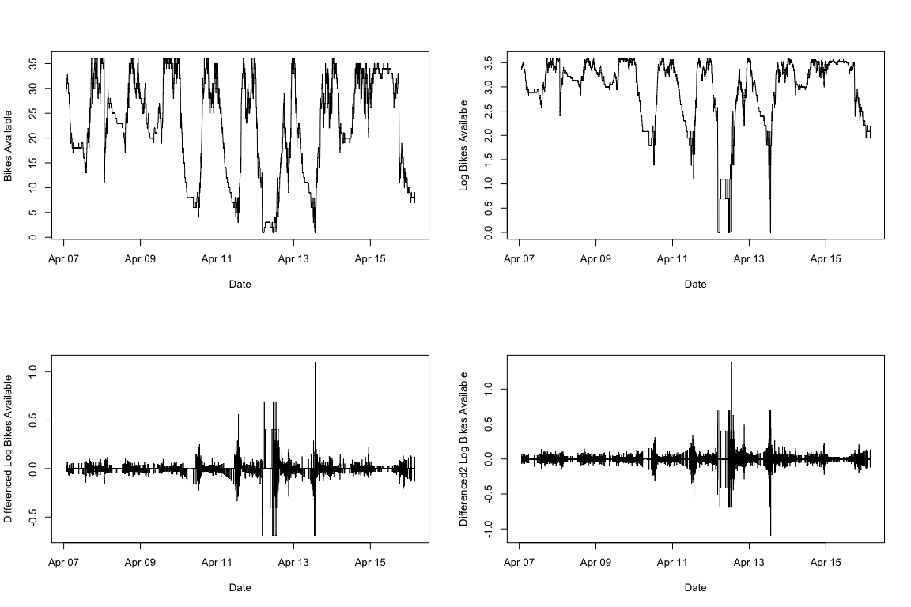

**Figures 2b, 3a, 3b. Timeseries of Log Bikes Available and ACF/PACF**

``` r
# Time series plot
layout(matrix(c(1,1,2,3), 2, 2, byrow = TRUE))
plot(date, log.status, type="l",
     xlab="Date", ylab="Log Bikes Available")

# ACF and PACF

Acf(log.status, na.action = na.pass)
log.status.acf <- Acf(log.status, na.action = na.pass, plot = FALSE)
pacf(log.status, na.action = na.pass)
```

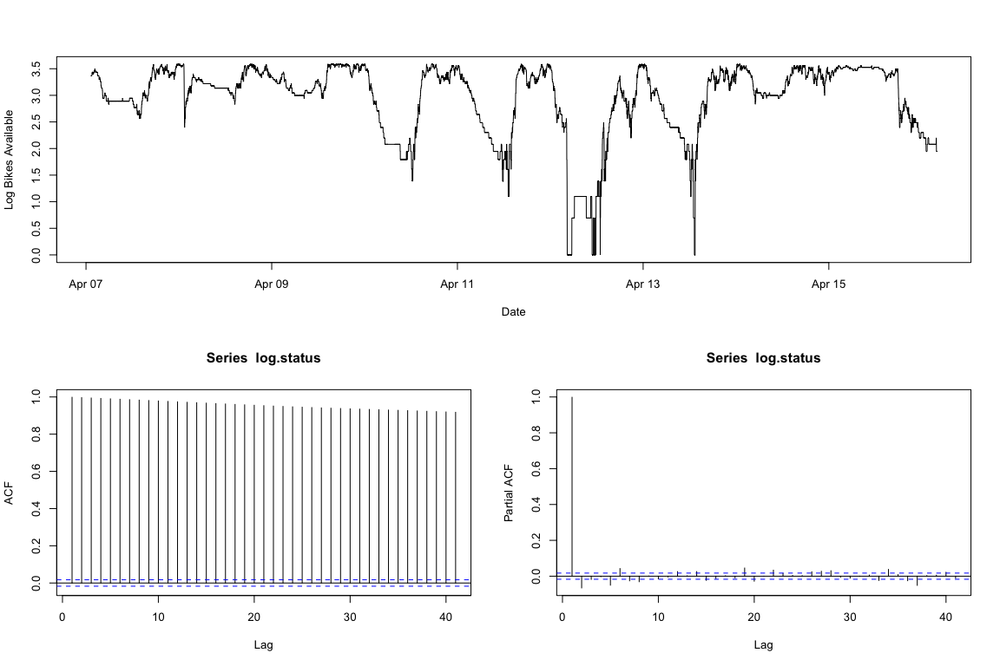

``` r
log.status.acf.table <- data.frame(log.status.acf$lag,  log.status.acf$acf)[-1,]
```

**Figures 2c, 3c, 3d. Timeseries of Differenced Log Bikes Available and ACF/PACF**

``` r
layout(matrix(c(1,1,2,3), 2, 2, byrow = TRUE))
# Time series plot
plot(date, diff.log.status, type="l",
     xlab="Date", ylab="Differenced Log Bikes Available")
# ACF and PACF
Acf(diff.log.status, na.action = na.pass)
pacf(diff.log.status, na.action = na.pass)
```

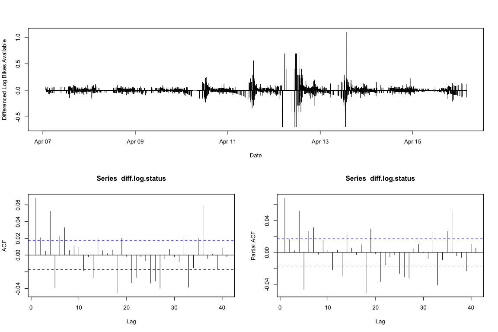

**Figures 2d, 3e, 3f. Timeseries of Twice-Differenced Log Bikes Available and ACF/PACF**

``` r
layout(matrix(c(1,1,2,3), 2, 2, byrow = TRUE))
# Time series plot
plot(date, diff2.log.status, type="l",
     xlab="Date", ylab="Differenced2 Log Bikes Available")
# ACF and PACF
Acf(diff2.log.status, na.action = na.pass)
pacf(diff2.log.status, na.action = na.pass)
```

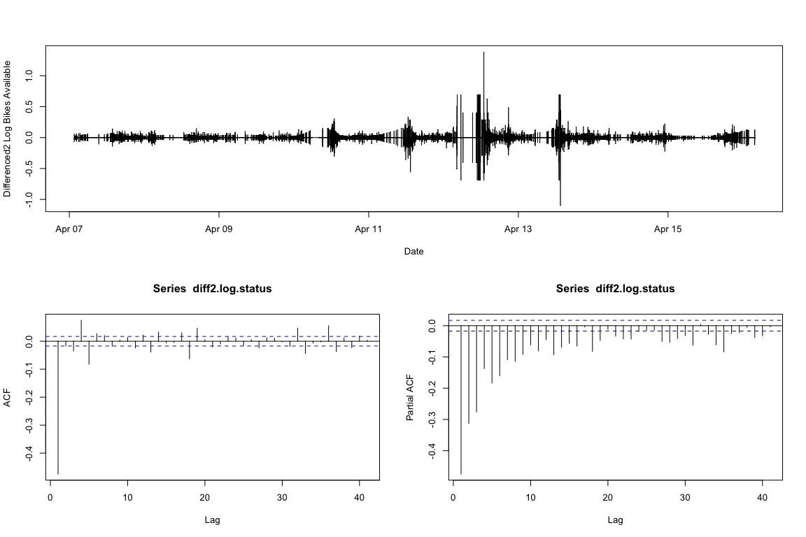

### Part 2: Using AICC to Identify Best p, q for ARIMA(p, 1, q) Model

**Figure 4. Computing the AICc values for ARIMA Candidate Models**

``` r
d <- 1

# choose p, q with AICc
for (include.constant in c(FALSE, TRUE)) {
    for (p in 0:4) {
        for (q in 0:4) {
            # work-around bug in R by manually differencing
            fit <- Arima(diff(log.status), c(p,0,q),
                         include.constant=include.constant, method="ML")
             cat("ARIMA",
                "(", p, ",", d, ",", q, ")",
                "(constant=", include.constant, ")",
                " : ", fit$aicc, "\n", sep="")
             #cat( p, ":", d, ":", q, ":",
            #     ":", include.constant, "",
             #    " : ", fit$aicc, "\n", sep="")
        }
    }
}
```

    ## ARIMA(0,1,0)(constant=FALSE) : -46902
    ## ARIMA(0,1,1)(constant=FALSE) : -46958.35
    ## ARIMA(0,1,2)(constant=FALSE) : -46961.45
    ## ARIMA(0,1,3)(constant=FALSE) : -46959.47
    ## ARIMA(0,1,4)(constant=FALSE) : -47001.25
    ## ARIMA(1,1,0)(constant=FALSE) : -46960.51
    ## ARIMA(1,1,1)(constant=FALSE) : -46963.24
    ## ARIMA(1,1,2)(constant=FALSE) : -46959.45
    ## ARIMA(1,1,3)(constant=FALSE) : -46957.45
    ## ARIMA(1,1,4)(constant=FALSE) : -47018.71
    ## ARIMA(2,1,0)(constant=FALSE) : -46961.91
    ## ARIMA(2,1,1)(constant=FALSE) : -46959.9
    ## ARIMA(2,1,2)(constant=FALSE) : -46959.72
    ## ARIMA(2,1,3)(constant=FALSE) : -46986.12
    ## ARIMA(2,1,4)(constant=FALSE) : -47039.36
    ## ARIMA(3,1,0)(constant=FALSE) : -46959.97
    ## ARIMA(3,1,1)(constant=FALSE) : -46957.91
    ## ARIMA(3,1,2)(constant=FALSE) : -46982.99
    ## ARIMA(3,1,3)(constant=FALSE) : -47052.78
    ## ARIMA(3,1,4)(constant=FALSE) : -47051.17
    ## ARIMA(4,1,0)(constant=FALSE) : -46993.07
    ## ARIMA(4,1,1)(constant=FALSE) : -47014.74
    ## ARIMA(4,1,2)(constant=FALSE) : -47043.02
    ## ARIMA(4,1,3)(constant=FALSE) : -47050.91
    ## ARIMA(4,1,4)(constant=FALSE) : -47049.37
    ## ARIMA(0,1,0)(constant=TRUE) : -46900.09
    ## ARIMA(0,1,1)(constant=TRUE) : -46956.43
    ## ARIMA(0,1,2)(constant=TRUE) : -46959.53
    ## ARIMA(0,1,3)(constant=TRUE) : -46957.55
    ## ARIMA(0,1,4)(constant=TRUE) : -46999.32
    ## ARIMA(1,1,0)(constant=TRUE) : -46958.59
    ## ARIMA(1,1,1)(constant=TRUE) : -46961.76
    ## ARIMA(1,1,2)(constant=TRUE) : -46957.53
    ## ARIMA(1,1,3)(constant=TRUE) : -46955.53
    ## ARIMA(1,1,4)(constant=TRUE) : -47016.79
    ## ARIMA(2,1,0)(constant=TRUE) : -46959.99
    ## ARIMA(2,1,1)(constant=TRUE) : -46957.98
    ## ARIMA(2,1,2)(constant=TRUE) : -46957.81
    ## ARIMA(2,1,3)(constant=TRUE) : -46984.2
    ## ARIMA(2,1,4)(constant=TRUE) : -47035.25
    ## ARIMA(3,1,0)(constant=TRUE) : -46958.05
    ## ARIMA(3,1,1)(constant=TRUE) : -46955.99
    ## ARIMA(3,1,2)(constant=TRUE) : -46980.94
    ## ARIMA(3,1,3)(constant=TRUE) : -47050.73
    ## ARIMA(3,1,4)(constant=TRUE) : -47049.09
    ## ARIMA(4,1,0)(constant=TRUE) : -46991.14
    ## ARIMA(4,1,1)(constant=TRUE) : -47012.81
    ## ARIMA(4,1,2)(constant=TRUE) : -47041.1
    ## ARIMA(4,1,3)(constant=TRUE) : -47048.97
    ## ARIMA(4,1,4)(constant=TRUE) : -47047.36

\*\* Figure 5. Final Estimates of ARIMA Parameters \*\*

Here is code to fit the ARIMA model, then compute residuals and the fitted values:

``` r
fit.mean <- Arima(log.status, c(3, 1, 3), include.constant=FALSE)
summary(fit.mean)
```

    ## Series: log.status 
    ## ARIMA(3,1,3) 
    ## 
    ## Coefficients:
    ##           ar1     ar2     ar3     ma1      ma2      ma3
    ##       -0.6394  0.1644  0.5990  0.7143  -0.0968  -0.6067
    ## s.e.   0.0984  0.1237  0.0723  0.1001   0.1331   0.0804
    ## 
    ## sigma^2 estimated as 0.001565:  log likelihood=23533.36
    ## AIC=-47052.71   AICc=-47052.7   BIC=-47000.41
    ## 
    ## Training set error measures:
    ##                         ME       RMSE        MAE MPE MAPE     MASE
    ## Training set -9.475436e-05 0.03955459 0.01217285 NaN  Inf 1.167503
    ##                      ACF1
    ## Training set -0.003174141

### Part 3: Residuals of the ARIMA Model

**Figure 6. Modified Box-Pierce (Ljung-Box) Diagnostics**

``` r
Box.test(diff.log.status, lag = 24, type = c("Box-Pierce", "Ljung-Box"), fitdf = 0)
```

    ## 
    ##  Box-Pierce test
    ## 
    ## data:  diff.log.status
    ## X-squared = 221.48, df = 24, p-value < 2.2e-16

``` r
Box.test(diff.log.status, lag = 36, type = c("Box-Pierce", "Ljung-Box"), fitdf = 0)
```

    ## 
    ##  Box-Pierce test
    ## 
    ## data:  diff.log.status
    ## X-squared = 349.56, df = 36, p-value < 2.2e-16

``` r
Box.test(diff.log.status, lag = 48, type = c("Box-Pierce", "Ljung-Box"), fitdf = 0)
```

    ## 
    ##  Box-Pierce test
    ## 
    ## data:  diff.log.status
    ## X-squared = 365.1, df = 48, p-value < 2.2e-16

Here are the residuals, with the last 10 residuals printed out:

``` r
resid <- residuals(fit.mean)
tail(resid, n=10)
```

    ## Time Series:
    ## Start = 12986 
    ## End = 12995 
    ## Frequency = 1 
    ##  [1]  0.015334141 -0.001851248  0.003245700  0.006805391 -0.005669778
    ##  [6]  0.006677641 -0.001189804 -0.001943458  0.005324153 -0.004712837

Here are the fitted values, with the last 10 fitted values printed out:

``` r
f <- fitted.values(fit.mean)
tail(f, n=10)
```

    ## Time Series:
    ## Start = 12986 
    ## End = 12995 
    ## Frequency = 1 
    ##  [1] 1.930576 1.947761 1.942664 1.939105 1.951580 1.939233 1.947100
    ##  [8] 1.947854 1.940586 1.950623

**Figure 7. ARIMA Residual Plots**

Here is a plot of the residuals:

``` r
plot(date, resid, type="l",
     xlab="Date", ylab="Bikes Available Residuals")
```

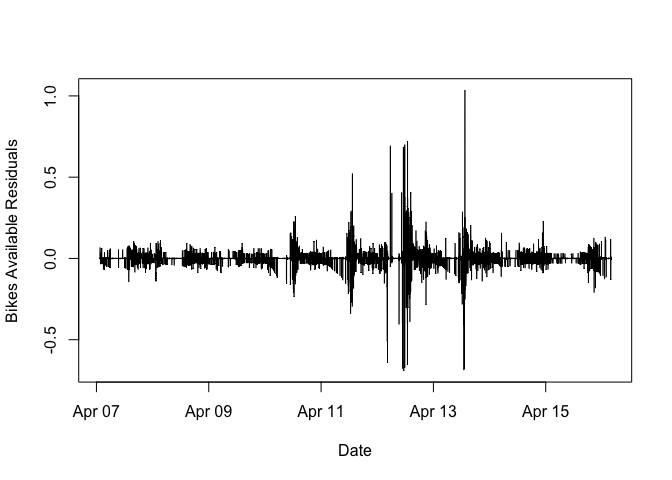

Here are the ACF and PACF of the residuals:

``` r
# ACF and PACF
par(mfrow=c(1,2))
Acf(resid, na.action = na.pass)
Pacf(resid, na.action = na.pass)
```

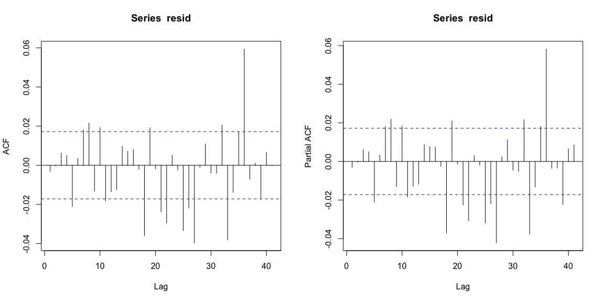

Here are the ACF and PACF of the squared-residuals:

``` r
# ACF, PACF of squared residuals.
par(mfrow=c(1,2))
Acf(resid^2, na.action = na.pass)
Pacf(resid^2, na.action = na.pass)
```

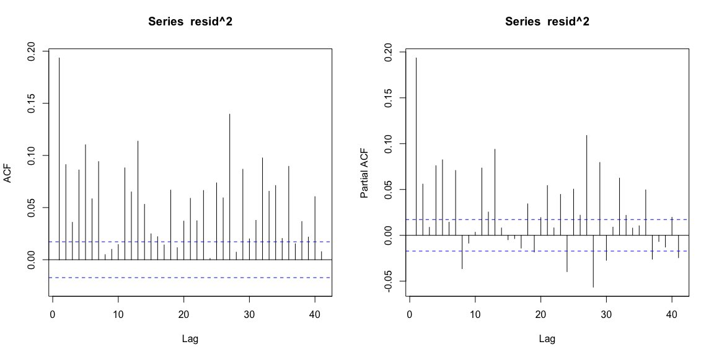

### Part 4: GARCH Model Selected

**Figure 8. AICc for Candidate ARCH/GARCH Models**

Here are the AICc values for the ARCH(q):

``` r
q <- 0:10
loglik <- rep(NA, length(q))
N <- length(resid)

for (i in 1:length(q)) {
    if (q[i] == 0) {
        loglik[i] <- -0.5 * N * (1 + log(2 * pi * mean(resid^2)))
    } else {
        fit <- garch(resid, c(0,q[i]), trace=FALSE)
        loglik[i] <- logLik(fit)
    }
}

k <- q + 1
aicc <- -2 * loglik  + 2 * k * N / (N - k - 1)

print(data.frame(q, loglik, aicc))
```

    ##     q   loglik      aicc
    ## 1   0 23535.70 -47069.40
    ## 2   1 24599.58 -49195.17
    ## 3   2 25231.45 -50456.89
    ## 4   3 25396.27 -50784.55
    ## 5   4 26038.83 -52067.66
    ## 6   5 26197.94 -52383.88
    ## 7   6 26462.68 -52911.36
    ## 8   7 26718.38 -53420.74
    ## 9   8 26727.14 -53436.26
    ## 10  9 26844.89 -53669.76
    ## 11 10 26909.97 -53797.91

Here is the AICc for the GARCH(1,1):

``` r
fit <- garch(resid, c(1,1), trace=FALSE)
```

    ## Warning in sqrt(pred$e): NaNs produced

``` r
loglik <- logLik(fit)
k <- 2
aicc <- -2 * loglik  + 2 * k * N / (N - k - 1)

print(data.frame(loglik, aicc))
```

    ##     loglik      aicc
    ## 1 30774.76 -61545.52

**Figure 9. Model Output for GARCH**

Here are the summary and log likelihood of the selected model:

``` r
fit.var <- garch(resid, c(1,1), trace=FALSE)
```

    ## Warning in sqrt(pred$e): NaNs produced

``` r
summary(fit.var)
```

    ## 
    ## Call:
    ## garch(x = resid, order = c(1, 1), trace = FALSE)
    ## 
    ## Model:
    ## GARCH(1,1)
    ## 
    ## Residuals:
    ##        Min         1Q     Median         3Q        Max 
    ## -2.175e+01 -6.514e-02  3.249e-06  6.761e-02  2.435e+01 
    ## 
    ## Coefficient(s):
    ##     Estimate  Std. Error  t value Pr(>|t|)    
    ## a0 5.255e-07   7.191e-09    73.08   <2e-16 ***
    ## a1 2.037e-02   1.232e-04   165.27   <2e-16 ***
    ## b1 9.812e-01   3.577e-05 27431.44   <2e-16 ***
    ## ---
    ## Signif. codes:  0 '***' 0.001 '**' 0.01 '*' 0.05 '.' 0.1 ' ' 1
    ## 
    ## Diagnostic Tests:
    ##  Jarque Bera Test
    ## 
    ## data:  Residuals
    ## X-squared = 2116700, df = 2, p-value < 2.2e-16
    ## 
    ## 
    ##  Box-Ljung test
    ## 
    ## data:  Squared.Residuals
    ## X-squared = 1.489, df = 1, p-value = 0.2224

``` r
logLik(fit.var)
```

    ## 'log Lik.' 30774.76 (df=3)

### Part 5: Compare One-Step Ahead Forecast Intervals of ARIMA vs. ARIMA-ARCH Model

**Figure 10. Forecast Intervals for ARIMA Model** Here is the one step ahead forecast and 95% forecast interval:

``` r
forecast(fit.mean, h=1, level = 95)
```

    ##       Point Forecast    Lo 95    Hi 95
    ## 12996       1.943208 1.865661 2.020754

**Figure 10. Forecast Intervals for ARIMA-ARCH Model**

``` r
a0 <- coefficients(fit.var)["a0"]
a1 <- coefficients(fit.var)["a1"]
b1 <- coefficients(fit.var)["b1"]
f1 <- 1.943208

# conditional variance:
h1<- a0 + a1*(tail(fit.mean$residuals,1)^2) +b1 * tail(fit.var$fit[,1],1)


# Finally, we compute the 95% forecast interval:
f1 + -1 * 1.96 * sqrt(h1)
```

    ## Time Series:
    ## Start = 12995 
    ## End = 12995 
    ## Frequency = 1 
    ## a0 + a1 * (tail(fit.mean$residuals, 1)^2) 
    ##                                  1.608779

``` r
f1 + 1 * 1.96 * sqrt(h1)
```

    ## Time Series:
    ## Start = 12995 
    ## End = 12995 
    ## Frequency = 1 
    ## a0 + a1 * (tail(fit.mean$residuals, 1)^2) 
    ##                                  2.277637

### Part 6: Conditional Variances

Here are the conditional variances, with the last 10 values printed out:

``` r
ht <- fit.var$fit[,1]^2
tail(ht, n=10)
```

    ## Time Series:
    ## Start = 12986 
    ## End = 12995 
    ## Frequency = 1 
    ##  [1] 0.0010309162 0.0010168000 0.0009982306 0.0009801559 0.0009631506
    ##  [6] 0.0009461772 0.0009297773 0.0009128071 0.0008962048 0.0008804159

**Figure 11. Conditional Variances** Here is a plot of the conditional variances:

``` r
# Add plot of the conditional variances
plot(date, ht, type="l", col=4)
```

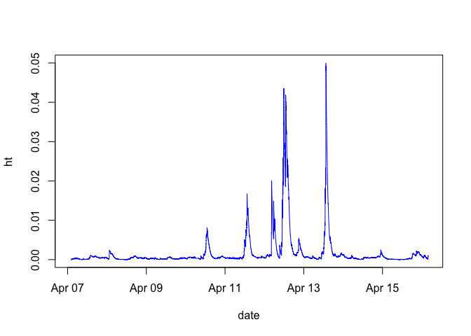

### Part 7 & 9: Forecast Intervals of the ARIMA/ARIMA-ARCH Model

``` r
plot(forecast(fit.mean, h=100, level=95), col=2)
```

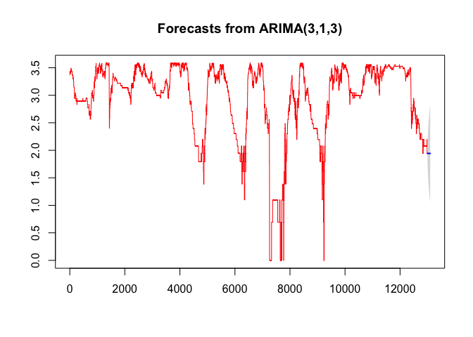

Defining the Upper and Lower Bounds of the 95% Forecast Interval

``` r
upper <- f + 1.96 * sqrt(ht)
lower <- f - 1.96 * sqrt(ht)
```

**Figure 12b. Log Bikes Available Forecast Intervals** Here is a time series plot which simultaneously shows the log bikes available, together with the ARIMA-ARCH one-step-ahead 95% forecast intervals based on information available in the previous day:

``` r
plot(date, log.status, type="l")
lines(date, upper, lty=2, col=2)
lines(date,  lower, lty=2, col=2)
```

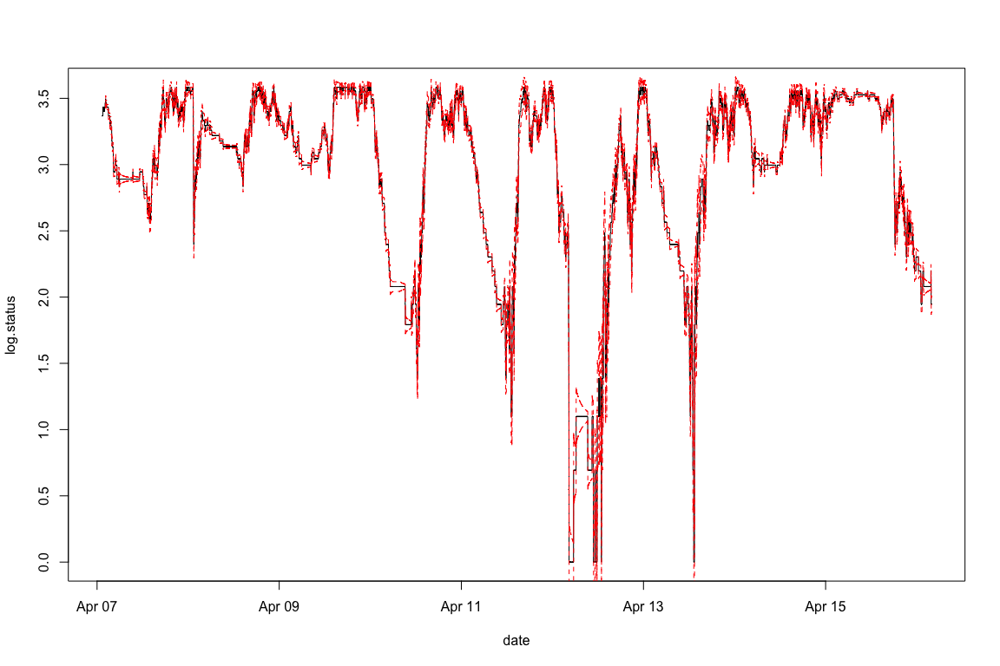

### Part 8: Residuals of the ARIMA-ARCH Model

Here is a normal probability plot of the ARCH residuals.

``` r
library("e1071")  
# Here we compute the arch residuals:

resid.arch <- resid / sqrt(ht)

plot(date, resid.arch, col=4, type="l")
```

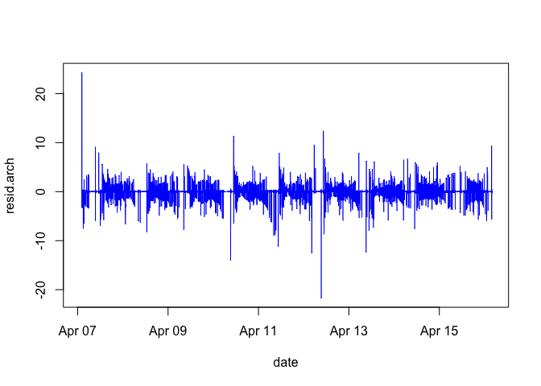

Here is the normal probability plot:

``` r
qqnorm(resid.arch)
qqline(resid.arch)
```

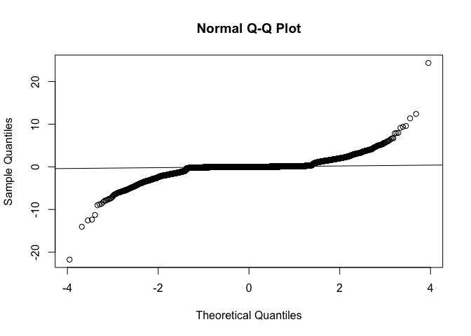

``` r
kurtosis(resid.arch, na.rm=TRUE)
```

    ## [1] 62.59582

``` r
# https://stackoverflow.com/questions/37897274/plot-lm-extracting-numbers-labelled-in-the-diagnostic-q-q-plot
resid.arch <- na.omit(resid.arch)
x <- sort(abs(resid.arch), decreasing = TRUE)
x[1:4]
```

    ## [1] 24.34881 21.74798 14.04521 12.55077

Here is a count of how many prediction interval failures there were:

``` r
# Count the number of times the prediciton
# interval failed:

sum(abs(resid.arch) >  1.96, na.rm=TRUE)
```

    ## [1] 738

The number of prediction intervals is:

``` r
sum(!is.na(resid.arch))
```

    ## [1] 12955
